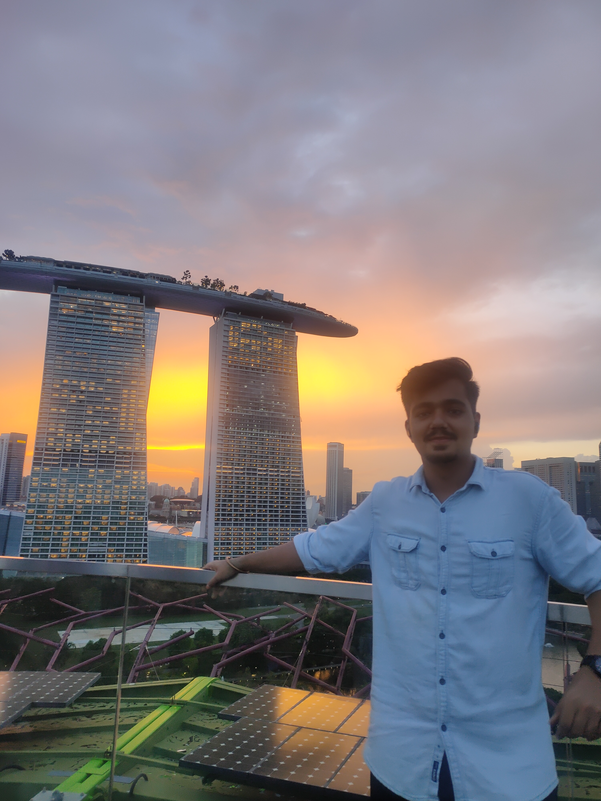

## Hi there 👋

<h1 style="margin:auto;text-align:center">
I am Amit Singh, an Engineer by heart ❤️.   Living, learning and leveling up one day at a time.
</h1>
<!-- 
 -->
<!--  -->
<!-- 
 -->
<!--
**amitsingh777/amitsingh777** is a ✨ _special_ ✨ repository because its `README.md` (this file) appears on your GitHub profile.
-->

<ul>
- 🔭 I’m currently working on an Open source Node JS project
</ul>
<ul>
- 🌱 I’m currently learning Sanskrit
</ul>
<ul>
- 👯 I’m looking to collaborate on Frontend to backend anything that involves Javascript
</ul>
<ul>
- 🤔 I’m looking for help with exploring Open source dimension
</ul>

<ul>
- 📫 How to reach me: Mail me on amitbrajeshsingh@gmail.com
</ul>
<ul>
- 😄 Pronouns: He/Him
</ul>
<ul>
- ⚡ Fun fact: I am looking forward to doing standup comedy soon 😗
</ul>
<ul>
- <a href="https://singhamit.netlify.app/" target="_blank">My Portfolio website 🕸️ 🏗️ </a>
</ul>
